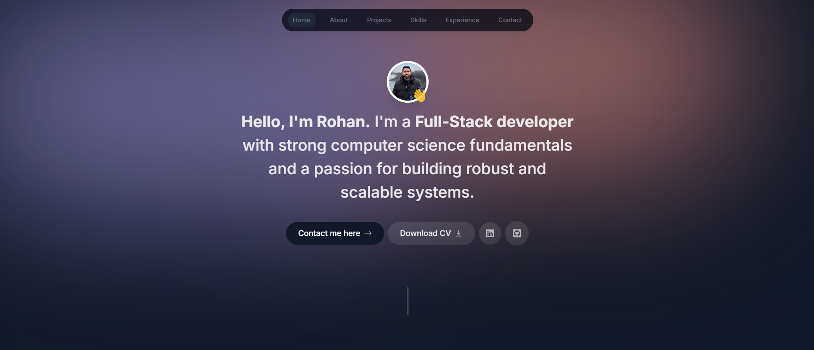

# Portfolio Website

Welcome to the repository for my personal portfolio website! This site showcases my work, skills, and experiences. It’s designed to provide a seamless and engaging user experience while being fast and accessible.

## 🌐 Website Link

[rohanpadhye.dev](https://portfolio-rohan-padhyes-projects.vercel.app/)


## 🖼️ Website Preview



## 🛠️ Technologies Used

This portfolio website is built using modern technologies to ensure scalability, responsiveness, and excellent performance. Here’s a breakdown of the tech stack:

- **Frontend Framework**: [React](https://reactjs.org/) & [Next.js](https://nextjs.org/) (App Router & Server Actions)
- **Programming Language**: [TypeScript](https://www.typescriptlang.org/)
- **Styling**: [Tailwind CSS](https://tailwindcss.com/)
- **Animations**: [Framer Motion](https://www.framer.com/motion/)
- **Email Functionality**: [React Email](https://react.email/) & [Resend](https://resend.com/)
- **Hosting**: [Vercel](https://vercel.com/)

## ✨ Features

- **Responsive Design**: Optimized for both desktop and mobile devices.
- **Smooth Animations**: Interactive transitions and motion effects using Framer Motion.
- **Contact Form**: Fully functional email integration using React Email and Resend.
- **SEO Optimized**: Built with Next.js to enhance search engine visibility.
- **Fast Hosting**: Deployed on Vercel for low-latency performance and global scalability.

## 🚀 Getting Started

### Clone the Repository
```bash
git clone https://github.com/yourusername/portfolio.git
cd portfolio

# 2. Install Dependencies
# Make sure you have Node.js installed
npm install

# 3. Start the Development Server
npm run dev
# Open http://localhost:3000 in your browser to view the website

# 4. Build for Production
npm run build

# 5. Deploy
# Ensure you have the Vercel CLI installed and configured
vercel
